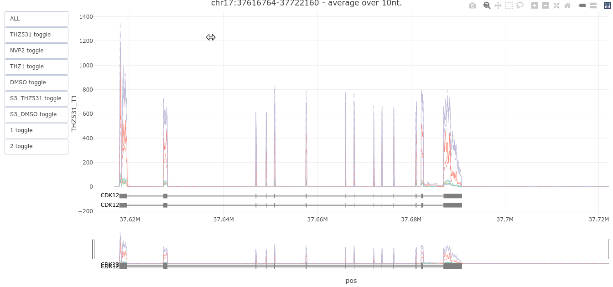

# Coverage viewer

a handful of functions and bits of code to create interactive vizualizations of overlayed coverage tracks, with zoomability and buttons to toggle the visibility of specific track groups.

These plots can be exported to static html to be shared with anybody without them having to run any further code.

You can also get the [html file for this demo](example_viz.html)

The repo is made of two main code files:

 * `coverage_viewer.Rmd`: takes you through an example to create a visualization 
 * `coverage_viewer_utils.R` : contains the helper function to load data, fetch annotations, and create the plot

## inputs

Coverages are expected to be found in [bigwig](https://genome.ucsc.edu/goldenPath/help/bigWig.html) files.

The code expects to provide them in a csv file containing sample information.

It should have the following columns:

 * sampleID : the sample ID
 * coverageFile : a bigWig file

+ any factor columns you may want to use to group tracks 

## parameters

In order to create the visualization you will need to specify:

 * a region to be plotted (chromosome, start, and end)
 * a subsampling factor (to limit the number of points to plot, it is also used to compute a rolling average)

Additionnally, the example code shows how to use an orgdb and refseq transcript annotation obtained from annotationHub to have "transcript box" annotations on the plot.
So to use these you will need to specify the annotationHub objects appropriate to your data.

